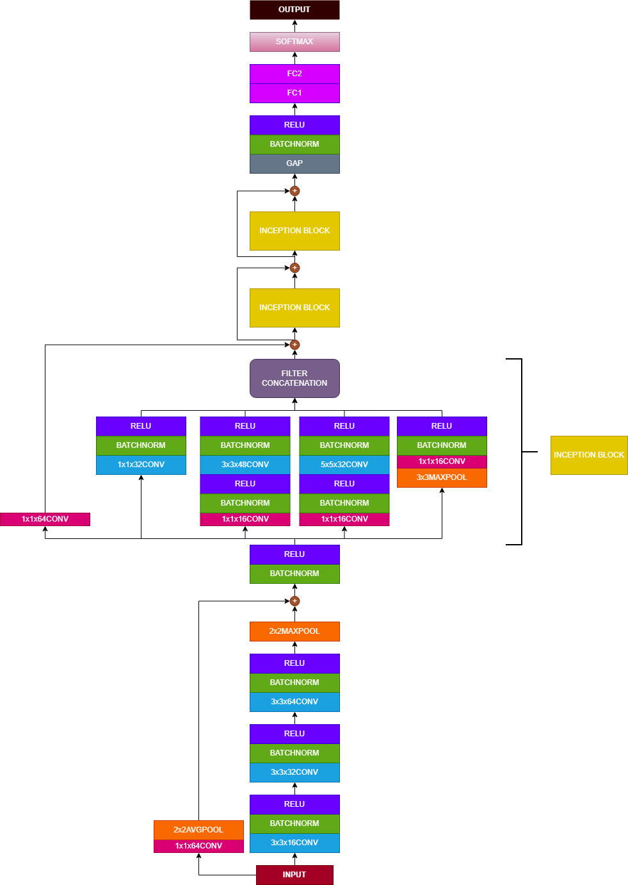
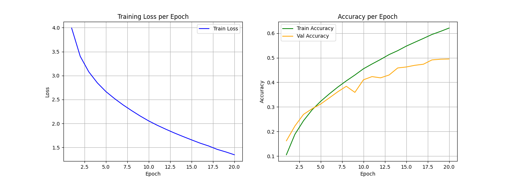
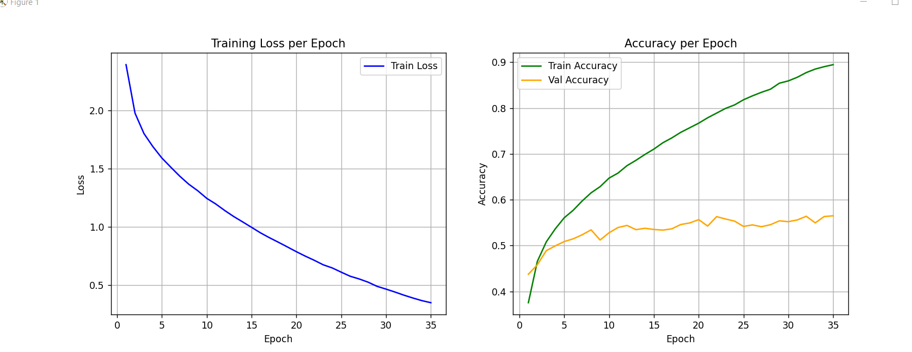
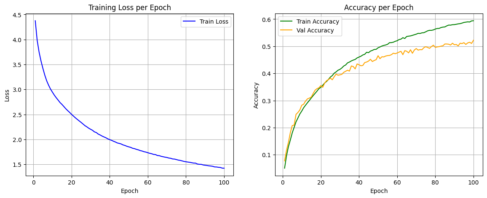
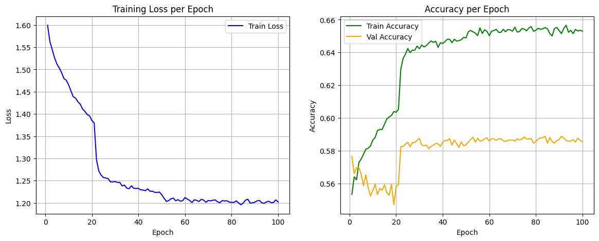
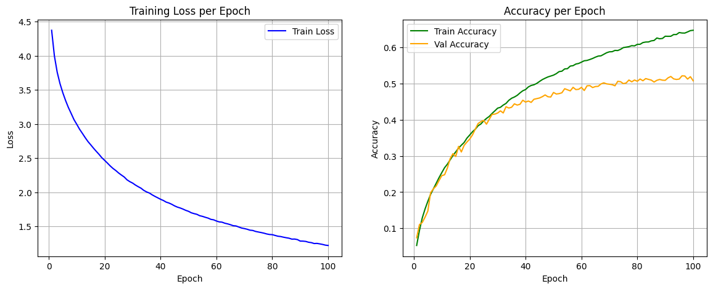
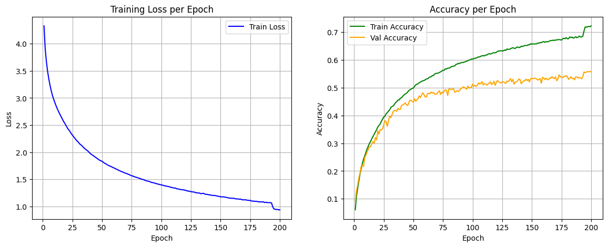

# CNN From Scratch

## 1. Purpose of the Project
The primary purpose of this project is to build a Convolutional Neural Network (CNN) entirely from scratch using only Python and NumPy. This project is aimed at gaining a deep, under-the-hood understanding of deep learning concepts—including forward propagation, backpropagation, and mathematical optimization—without relying on high-level frameworks like PyTorch or TensorFlow.

## 2. Project Structure
To maintain a clean and modular codebase, the project is divided into four main files:

- `src/components.py`: Core mathematical operations, activation functions, and helper algorithms.
- `src/layers.py`: Object-oriented layer definitions that comprise the neural network.
- `src/model.py`: The CNN architecture implementation, training, testing, visualization and checkpoint methods. 
- `src/main.py`: Load and treatment of CIFAR100 dataset, hyperparameters definition and model execution. 

## 3. File Contents and Implementation Details

### `src/components.py`
This file implements the essential, low-level mathematical operations that power the deep learning layers.
- **Indexing and Convolutions:** Convolutions are built leveraging the `im2col` (image-to-column) and `col2im` algorithms. By reshaping images and filters into 2D matrices using indexing, convolution operations are transformed into simple Matrix Multiplications (GEMM). This massively speeds up the computation by making full use of NumPy's highly optimized C backend.
- **Activations and Losses:** Implements functions like ReLU, Leaky ReLU, Softmax, and Cross-Entropy loss.
- **Hyperparameters:** Defines operations involving hyperparameters like `alpha` (momentum), `beta`, and `gamma` (such as in Batch Normalization).

### `src/layers.py`
This file defines the object-oriented architectural building blocks of the network. Every layer is fundamentally engineered from scratch with explicit mathematical formulations for both forward propagation and deep backpropagation (via the chain rule).
- **Core Layers:** Custom implementations of advanced layers including standard and depth-wise `Convolution`, `Pooling` (Max and Average), `Fully Connected` (Dense) layers, and `BatchNorm2D` (handling multi-dimensional running statistics and learned affine parameters).
- **Gradient Math & Caching:** Each layer encapsulates a rigorous `backward()` method. Forward-pass intermediate tensors are intelligently cached to perform exact matrix calculus during the backward pass, calculating parameter gradients (`dW`, `d_gamma`) and input gradients (`dX`) while continuously managing spatial and memory overhead.

### `src/model.py`
This file defines the overarching CNN architecture, specifically implementing a residual network structure. It also handles the orchestration of the training, testing, and validation forward/backward passes.
- **Architecture Setup:** Constructs the sequence of layers, including residual convolution blocks, pooling mechanisms, and the final fully connected classifier.
- **Training and Checkpoints:** Orchestrates the core forward and backward propagation passes, and includes methods for saving and loading model checkpoints.
- **Visualization:** Implements functionality to systematically plot the training progress per epoch, including visual checks for training loss vs validation loss and accuracy metrics over time.



### `src/main.py`
This script is the primary entry point to initialize the data, configure hyperparameters, and execute the complete training loop.
- **Dataset Handling:** Loads, normalizes, and reshapes the **CIFAR-100** image dataset. Also includes helper methods for one-hot encoding labels and splitting data into training and validation sets.
- **Hyperparameters & Execution:** Defines constraints like epochs and data structure, instantiating the CNN class and managing the batch feeding and main loop execution.

## 4. Key Engineering & Technical Highlights
This project goes beyond mathematical definitions and focuses heavily on systems engineering to make the model capable of training efficiently on real-world datasets:
- **GPU Acceleration via CuPy:** The core numpy-like operations have been seamlessly parallelized onto the GPU using **CuPy**. This transforms Python-level matrix math into underlying CUDA calls processing massively faster.
- **Advanced Memory Management:** To prevent Out-Of-Memory (OOM) errors during the backward pass, deliberate garbage collection and VRAM pooling triggers are implemented. Training data is strictly batched, enabling the training of deeper layers.
- **Modern ResNet Architecture:** Constructs deep Residual Convolution blocks equipped with Shortcut Connections, enabling the network to sidestep the vanishing gradient problem.
- **Training Optimizations:** Features custom-built learning rate schedulers (LR decay upon validation plateaus) and strictly initialized layers utilizing **He Initialization** logic natively.

## 5. Architectural Evolution & Optimization Journey
Building this network from scratch required several rigorous architectural iterations to successfully scale the model for the CIFAR-100 dataset ($32 \times 32$ resolution). 



**1. Removing Redundant Bottlenecks:** 
Initially, the architecture consisted of a ResBlock followed by an Inception module, with standard convolutions placed *between* the Inception blocks. I quickly realized this intermediate convolution was mathematically destroying the heavily parallelized feature extraction achieved by the preceding Inception module. It forcefully squashed the multi-scale features back into a single filter size while massively inflating computational overhead, leading to early overfitting.



**2. Scaling the Feature Maps:**
After dropping the intermediate convolutions, the network was outputting massive 480-channel feature maps directly out of the Inception blocks. Because CIFAR-100 images lack the geometric complexity of $224 \times 224$ images, these 480 channels were largely mapping black zero-padding and white noise. Scaling the parallel channels down to a tighter 128-channel output and adding L2 Regularization with `l2=1e-5` drastically stabilized the network, achieving a baseline validation accuracy of **58%** after training for 100 epochs, checking it weren't enought and then training for another 100 epochs.

First 100 epochs:


Last 100 epochs: 


**3. The Receptive Field Ceiling:**
To push past 58%, I hypothesized that depth was the limiting factor and stacked two additional Inception blocks (totaling 5). However, validation accuracy completely stalled. By calculating the physical Receptive Field of the parallel branches, I deduced that the network hit the 32-pixel physical boundary of the image by the 3rd block. The 4th and 5th blocks were purely convolving over the artificial zero-padding, meaning adding depth was mathematically incapable of extracting new spatial context. 



**4. Fixing the Residual Gradient Flow:**
Finally, while auditing the matrix calculus of the backpropagation pass, I discovered a critical flaw in the initial ResBlock. The final convolution in the main path was passed through a ReLU *before* being added to the identity shortcut. This physically clamped all signals to $\ge 0$, destroying the network's ability to output negative gradient adjustments (i.e., it could only ever "add" to the highway, never "subtract"). Removing this terminal ReLU strictly restored the mathematical integrity of the $F(x) + x$ residual equation. In order to achieve the maximum training potencial, I've trained for 200 epochs as well. However, it didn't perform as well as the previous model with 200 epochs, achieving a validation accuracy of **55%**, since the model was more stable, it took longer to arrive at a plateau in order for the lr to change from **1e-3** to **1e-4**, while the other model finished training with a lr of **1e-6**. As shown in the plot, we had a spike around 180 epochs, which is a characteristic behaviour of learning rates change. I hypothetize that while training for 100 epochs more and being more aggresive with the lr_patience, it could have gone over the **60%** of validation accuracy. 




**Conclusion:** 
Building this engine entirely from scratch provided invaluable insight into the fact that deep learning isn't just about adding layers. The mathematical dimensions of the matrices, the spatial receptive limits of the filters, the gradient flows of shortcuts, and the GPU memory constraints must all be engineered in perfect unison in order to achieve a satisfying and solid result. 


## 6. How to Use This Repository

1. **Clone the repository:**
   ```bash
   git clone <your-repository-url>
   cd CNN_from_scratch
   ```

2. **Install the dependencies:**
   The project primarily depends on CuPy (for GPU-accelerated matrix math) and Matplotlib (for visualization). Note: You must have the CUDA toolkit installed in your system.
   ```bash
   pip install cupy-cuda12x matplotlib
   ```

3. **Run the training script:**
   Once the dataset is configured, you can start the complete training loop by running:
   ```bash
   python src/main.py
   ```

## 7. Further Work
While the current scope focuses heavily on Computer Vision and Convolutional Neural Networks, future plans for this repository include expanding its capabilities to handle sequential data and modern NLP architectures:
- Implementing **Recurrent Neural Networks (RNNs)** from scratch.
- Implementing **Transformers** (incorporating Multi-Head Self-Attention mechanisms) entirely from scratch using NumPy.
